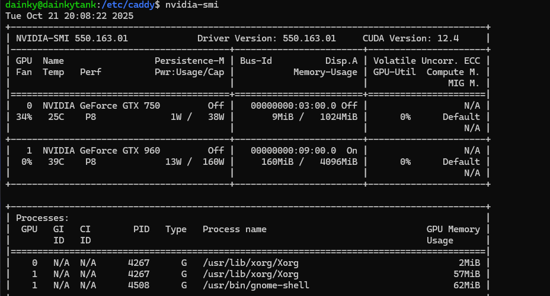
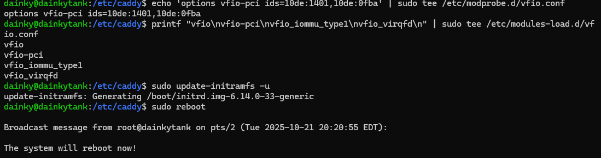
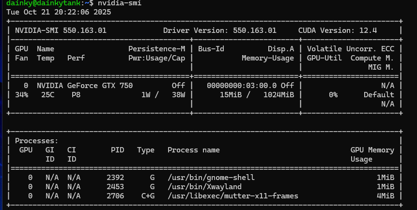
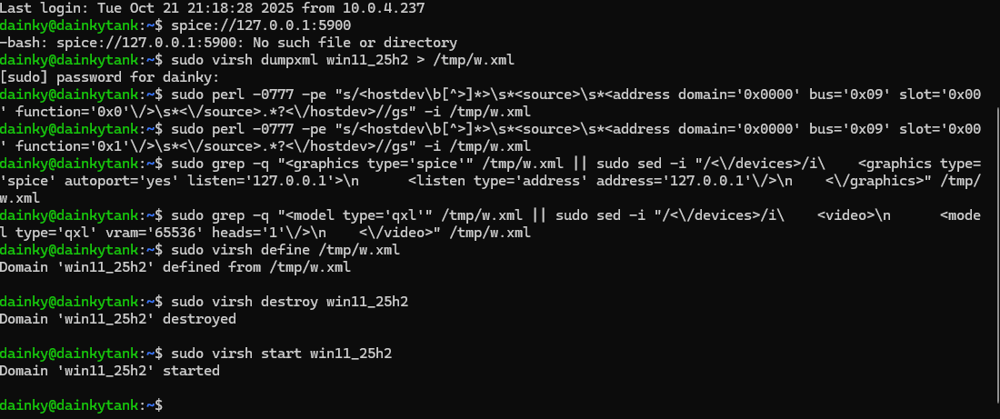
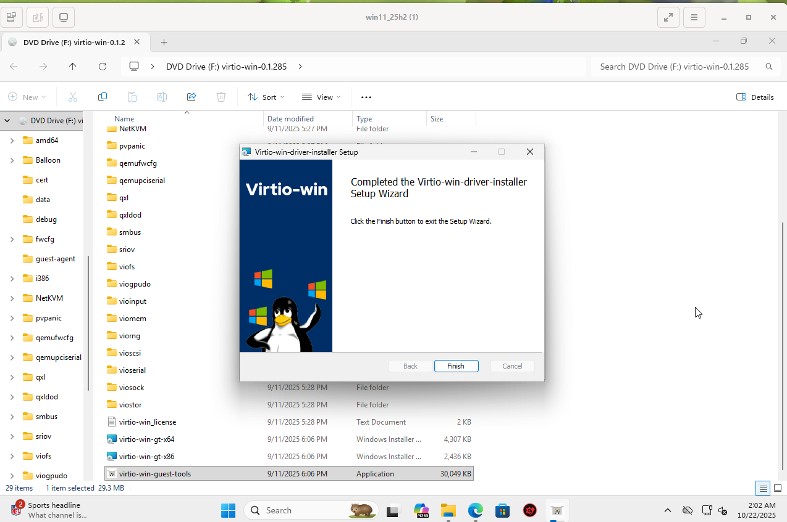
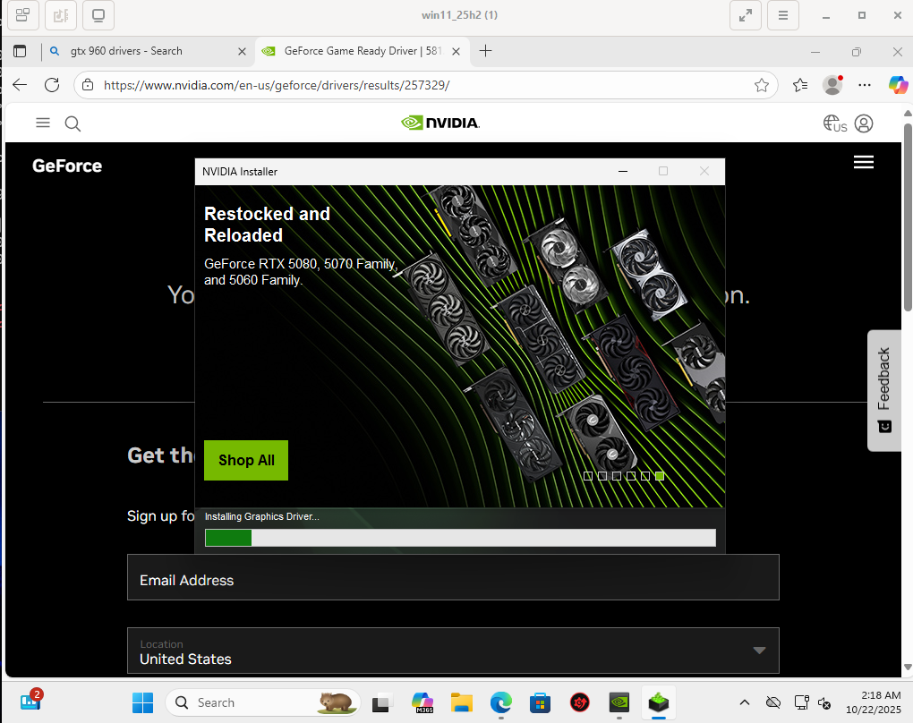
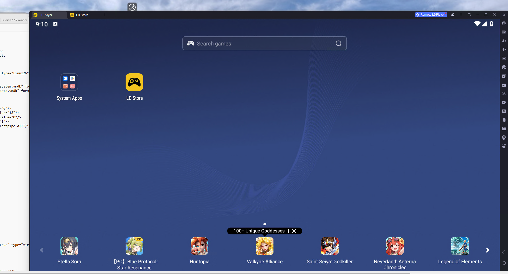

-------------------------------------------------------------------------
This walkthrough covers passing through a GPU to a Windows VM running inside a KVM virtual machine on Ubuntu, done as part of a homelab setup.

### Check GPU on Host
Verified the GPU was detected on the host before starting the passthrough process.  

------------------------------------------------------------------------

### Enable GPU Passthrough
Enabled GPU passthrough settings so the VM could use the dedicated GPU.  

------------------------------------------------------------------------

### Bind GPU to VFIO
Bound the GPU to vfio-pci and rebooted to apply the passthrough configuration.  

------------------------------------------------------------------------

### Passthrough Successful
Confirmed the VM successfully recognized the passed-through GPU.  

------------------------------------------------------------------------

### Remove Host GPU Use
Unbound the GPU from the host so only the VM was using it.  

------------------------------------------------------------------------

### VM Running with GPU
The Windows VM booted and ran using the passed-through GPU.  

------------------------------------------------------------------------

### Install GPU Drivers
Installed the correct GPU drivers inside the Windows VM.  

------------------------------------------------------------------------

### Fix OpenGL
Fixed OpenGL and graphics acceleration issues inside the VM.  

------------------------------------------------------------------------

### Performance Issues
GPU passthrough was working, but performance was initially slow.  

------------------------------------------------------------------------

### Fix CPU Allocation
Adjusted the CPU allocation so the VM performed properly.  

------------------------------------------------------------------------

### Conclusion 

-------------------------------------------------------------------------
