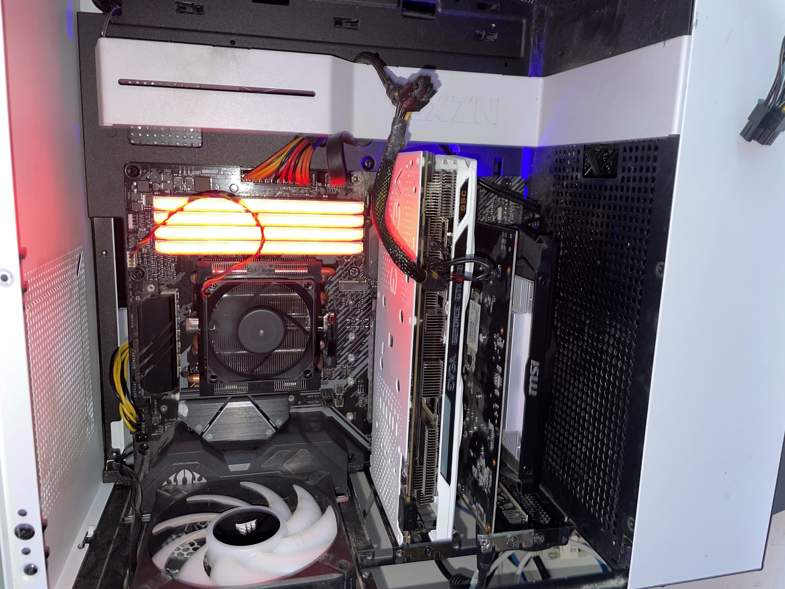

-------------------------------------------------------------------------

This walkthrough covers the complete process of setting up GPU passthrough to a Windows virtual machine running on Linux using KVM/QEMU. GPU passthrough allows the VM to have direct access to my physical GPU, providing near-native graphics performance.

This is useful for gaming VMs, GPU-accelerated workloads, or testing different graphics configurations without dual-booting. By the end of this guide, my Windows VM will have full control of a dedicated GPU.

### Check GPU on Host
Verified the GPU was detected on the host before starting the passthrough process.  

------------------------------------------------------------------------

### Enable GPU Passthrough
Enabled GPU passthrough settings so the VM could use the dedicated GPU.  

------------------------------------------------------------------------

### Bind GPU to VFIO
Bound the GPU to vfio-pci and rebooted to apply the passthrough configuration.  

------------------------------------------------------------------------

### Passthrough Successful
Confirmed the VM successfully recognized the passed-through GPU.  

------------------------------------------------------------------------

### Remove Host GPU Use
With the GPU unbound from the host, we can now configure the VM to use it. This involves editing the VM's XML configuration to include the GPU as a passthrough device. We will use Spice and QXL for the display until the GPU drivers are installed in the VM

------------------------------------------------------------------------

### VM Running with GPU
We installed Virtio drivers inside the VM to help disk/network/vm performance. After the installed the performance was instantly and noticeably increased

------------------------------------------------------------------------

### Install GPU Drivers
We installed the NVIDIA drivers for the 960 inside the VM. This allows the VM to utilize the GPU for rendering and other tasks. After this, I expected the be able to pass through the GPU easily, but there was alot of difficulty with the configuration. For example, while the VM saw the GPU, it was barely able to use it because QXL/Spice forcing OpenGL 1.0 and no higher.

------------------------------------------------------------------------

### Fix OpenGL
This part took quite a while to figure out. I kept trying to use QXL as the makeshift RDP to use the VM, but if I had it enabled it would force low OpenGL Versions. I tried connecting a monitor directly to the GPU and directly installing differnet RDPs, but the VM wanted to have sepearte USBs dedicated to the machine. I figured there must be a better way. Eventually, I disabled QXL and started using windows built in RDP Remote Desktop which worked much much better. This also allowed for higher version of OpenGL to finally be used since QXL and Spice were no longer needed. The image above is LDplayer loading above 50%, meaning the OpenGL requirement had been fufilled.   

------------------------------------------------------------------------

### Performance Issues
GPU passthrough was working, but performance was initially slow.  

------------------------------------------------------------------------

### Fix CPU Allocation
After some fiddling with the XML file, I was able to unlock all 8 cores for the VM. This significantly improved performance and responsiveness within LDPlayer, actually making it useful now if needed. Hyper-V was also an issue, as LDplayer reccomends it off. But it actually ran fine even with it on. After multiple tests it may have even performed better with it on but always gave us a popup and a warning. So instead of deleting it we just disabled it and hid it from windows. When we just disabled it, windows would re-enable it everytime. So we hid it too. And boom, no more hyper-v errors, and our vm was running clean.

------------------------------------------------------------------------

### Conclusion 

This was a good project for me, because I enjoy creating cloud like enviroments for niche tasks. I hate having my main PC cluttered with random things always running when instead I can have old PC parts laying around take that job instead on a server. This part of the overall project was a big success, for awhile I did not believe we could get OpenGL to work above 1.0. I found another older gpu, a 760, that I gave to the server to serve as its head if needed. I really only ever use it headless, but somtimes I break things and can't get in with ssh etc so the 760 being there is nice just in case. It also allowed to reallocate the 960 to be used for actually demanding tasks like running VMs with Emulators. The final step will be to polish the enivroment and start managing the LDplayer bots from the cloud. I would love to have an interface on the homepage where I can enable and disable the LDplayer bots and get feedback from them (screenshots). If completed, I will have a full cloud enviroment for my bots. 

-------------------------------------------------------------------------
