# 🎬 Jellyfin + Usenet Automation Stack

Jellyfin came soon after my Nextcloud project. While Jellyfin wasn’t as much of a necessity as Nextcloud, I thought it was a cool concept — having a personal Netflix with **anything I wanted**, accessible **anywhere in the world**. I mean, that’s kinda cool, yeah?

---

### 🧠 Background

The main issue with Jellyfin was that you had to **manually install every movie**, name it properly, and move it to the right folder. Like I mentioned in the previous log, I had found and even set up some basic automation tasks using **Radarr** and **Prowlarr**, but they were hosted on my main Windows machine.

That meant every time I downloaded a movie, I had to **transfer it via SCP** to the server — which took forever. On top of that, I forgot the login password for both Radarr and Prowlarr, though you can disable authentication in the config if needed.

So, the easy solution: move the **entire stack directly to the server**, polish it up, and integrate everything under one automated workflow.  
And that’s exactly what I did.

---

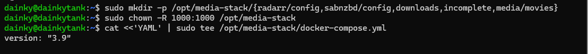
**Step 1:** Create a new container stack for Radarr and SABnzbd using Docker. These will handle all our movie automation and downloads.

---

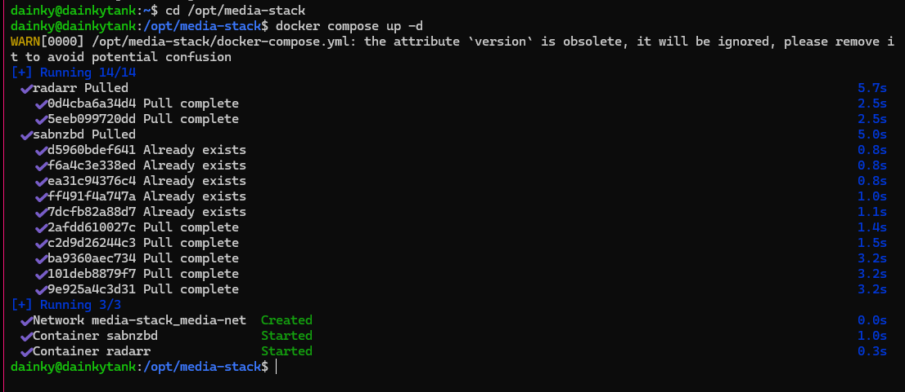
**Step 2:** Pull the Radarr and SABnzbd images — our new containers are created inside the stack.

---

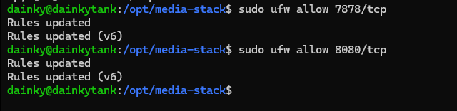

**Step 3:** Update a few network rules to make sure the containers can communicate properly within the stack.

---

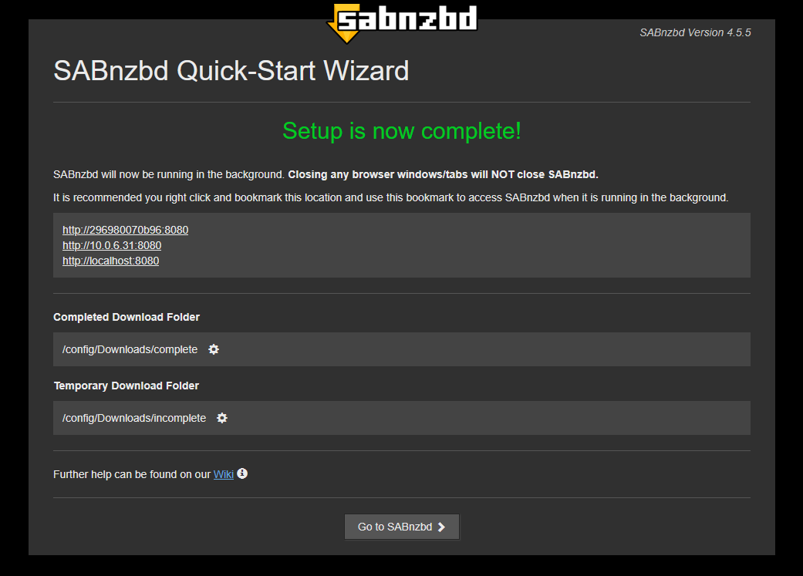
**Step 4:** SABnzbd is installed and accessible via the web UI. The downloader portion of the workflow is now ready.

---

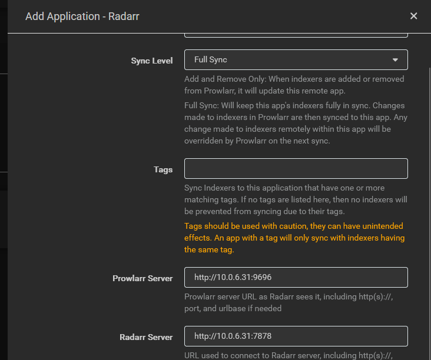

**Step 5:** Inside Radarr’s web interface, we point **Prowlarr** to Radarr as its indexer manager.  
This links movie searches to the indexers we configure later.

---

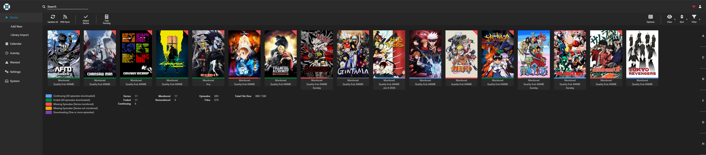
*Added post-project but belongs here in the workflow:*  
A separate **Sonarr** instance was configured specifically for anime to avoid naming conflicts and library mix-ups, since anime tends to use different naming schemes.

---

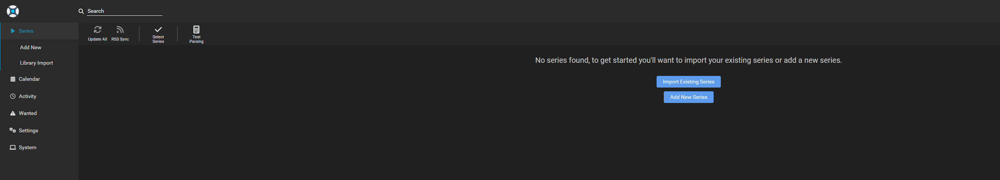
*Also post-project:*  
A second **Sonarr** instance was added for general TV series like *The Office*, *Game of Thrones*, and *Dexter*.  
Currently, this library is empty — mostly because I prefer movies and anime (and I’ve already seen most of the good shows).

---

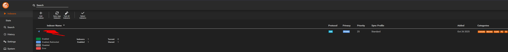
**Step 6:** Prowlarr is linked to our chosen **indexer (hidden out of respect)** — this is where it fetches the actual NZB data.

---

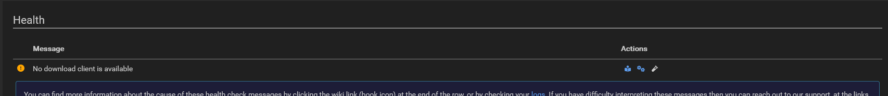
**Step 7:** Time to configure our download client — **SABnzbd** — so it can fetch data from the indexers and store files in the correct directories.

---

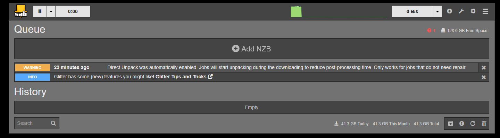
**Step 8:** SABnzbd is configured and connected to Radarr and Sonarr. Everything’s now automated from search to download.

---

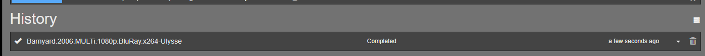
**Step 9:** Test run: *Barnyard* was requested through Radarr → Prowlarr queried the indexer → found the file → passed it to SABnzbd → download complete.

---

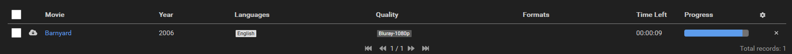
**Step 10:** After the download, Radarr recognizes the movie, renames it, and applies the correct metadata format for Jellyfin.

---

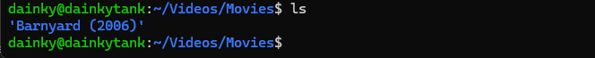
**Step 11:** Radarr imports the completed movie into our **new 4TB HDD**, where it will live permanently and be served to Jellyfin.

---

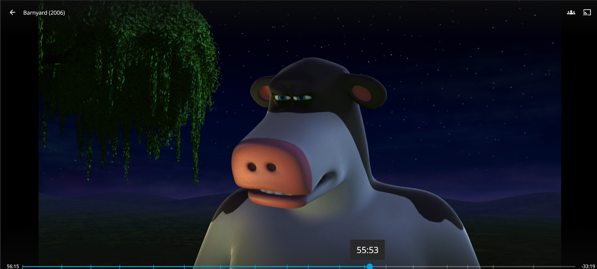
✅ **Success:** The movie is now watchable through Jellyfin — both locally and remotely. The entire automated workflow works flawlessly.

---

**Step 12:** Drive overview — our 4TB HDD for movies, a 500GB SSD for the OS, and an old 2TB drive salvaged from another PC.

---

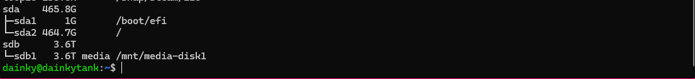
**Step 13:** Tried formatting the 2TB drive, but it vanished mid-format. After some troubleshooting, it turned out to be fried. RIP — could’ve held another 50 movies. 😭

---

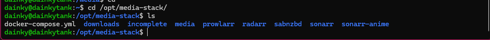
**Step 14:** Final Docker stack lineup:  
> **Prowlarr**, **Radarr**, **SABnzbd**, **Sonarr**, and **Sonarr-Anime**

---

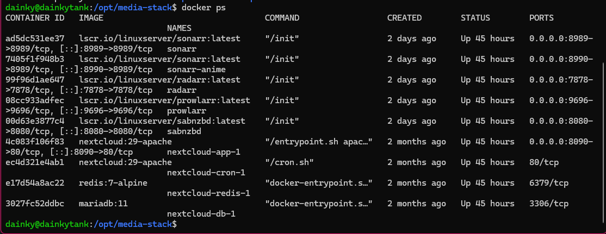
**Step 15:** A few days later — all containers are still running strong, no hiccups.

---

**Step 16:** Updated Jellyfin interface with new **TV Shows**, **Anime**, and **Movies** folders.  
Also added custom CSS from the gorgeous [Ultrachromic theme](https://github.com/CTalvio/Ultrachromic) by CTalvio.

---

### 🧾 Conclusion

While it isn't baked into the screenshots as much as I’d like, this entire stack is powered by **Usenet**, which costs around **$12/month** for access to the download servers.
I can download a **40GB movie in 10 minutes** on a 1 Gbps connection. A torrent would take like an hour or so. This can all be done using torrents for free — but trust me, **Usenet is insanely faster**.  

Also, this log looks very short, like you could complete this in a few hours. If you're codingjesus, sure maybe. But there is alot that isn't shown here for many different reasons. One being that API keys were EVERYWHERE in this project. Another being that there were hours and hour spent on really small dumb things nobody wants to care about.
For example, you have to setup quality profiles, languages and subtitels, figure out which quality order you want for what, and more. Anime was having a very hard time downloading for a long time, until I learned they use different epsiode naming schemes. Normal tv shows go with S01EP02 formatting. Well anime usually just goes with a raw number, like One Piece 062. 
That small detail meant very little was downloading making the stack look broken, but it wasn't. Just a small detail. One thing I still struggle with is aobut 10% of the time, radarr fails to auto import. Which means I neeed to go in and manually move the file into the correct folder. Most likely a naming issue. 
Then there was stuttering over the web when trying to access it. Well, turns out streaming a 1080p Remux directly needs lots of upload, and I only have 35 upload. So we had to turn on some transcoding magic to lower that down a bit. 

This setup turned what used to be a semi-practical workflow (manual downloads, naming, and transfers) into a **fully automated media pipeline**. Now, all I need to do is **search for a movie**, hit **add**, and it appears in my Jellyfin library minutes later — metadata, cover art, and all.

The only real limit now? **Storage.**  
Did I fill a 4TB drive in two days? Maybe.  
Do I have a new storage addiction? Maybe. 

We’ve been using this setup over Halloween, and it’s been incredible. Last night we watched *The Wailing* — requested it in Radarr, the **40GB Remux version** downloaded in 10 minutes flat.  
Great movie, by the way.

---

> *All media downloaded was already legally owned by me and transferred from personal backups of legally purchased copies.*

