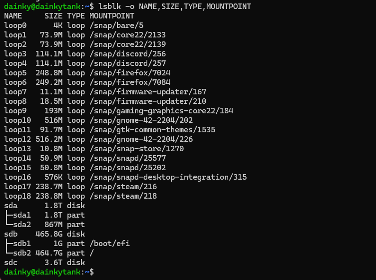

Jellyfin is super useful, the main problem with it was that you had to manually install every movie, name it, and then move it to the correct folder. 

Sample text

Sample text

Sample text

Sample text

Sample text

Sample text

Sample text

Sample text

Sample text

Sample text

Sample text

Sample text

Sample text

Sample text

Sample text

Sample text

Sample text

Sample text

Sample text

Sample text

Sample text

