This walkthrough shows the steps taken to prepare an Ubuntu system to act as a virtualization host using KVM, Libvirt, and Cockpit.

### Update the System
Run system updates to ensure all packages are up to date.  
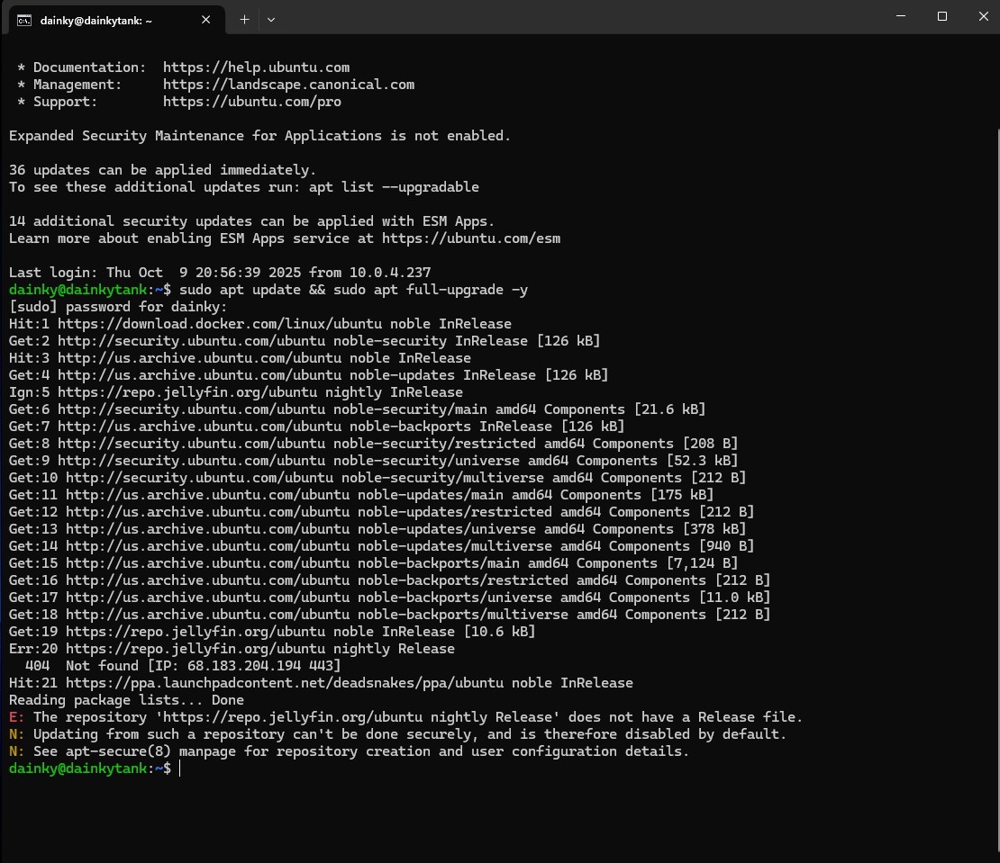

### Remove Unsupported Repository
Remove incorrect or unsupported repositories to prevent package conflicts.  
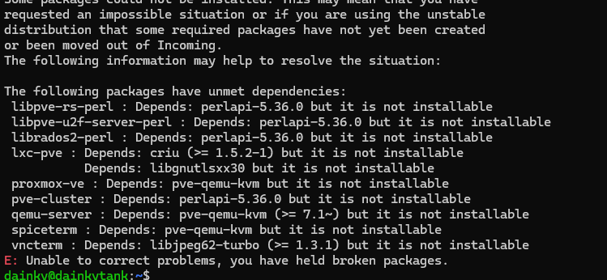

### Install Virtualization Packages
Install KVM, Libvirt, Cockpit, and required dependencies.  
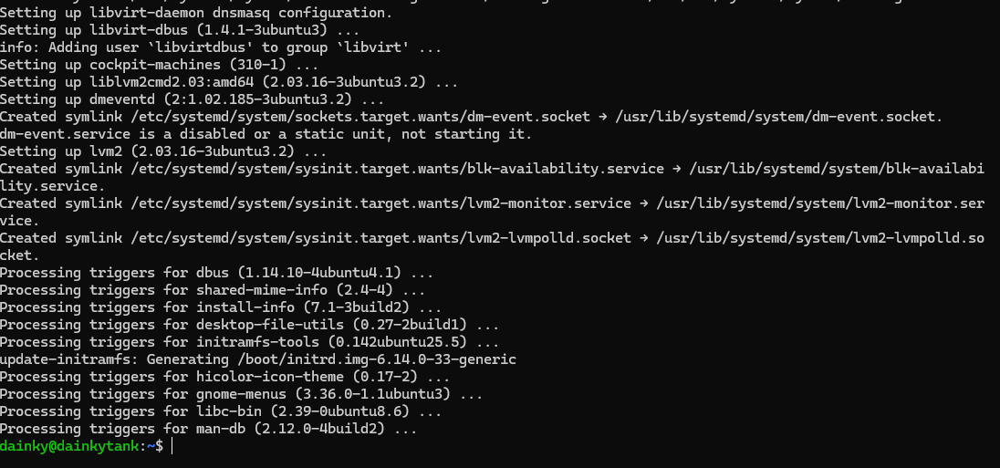

### Enable CPU Virtualization Support
Enable CPU virtualization features and load required modules.  
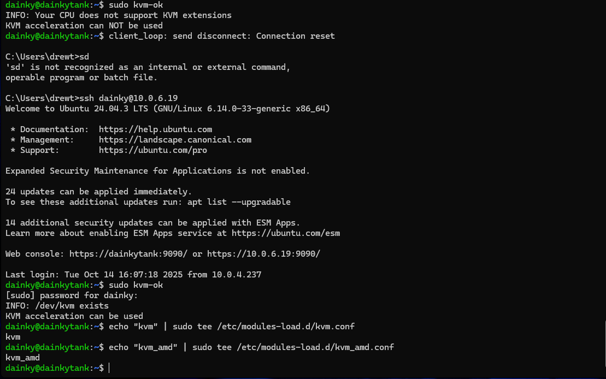

### Confirm Virtualization is Active
Verify that virtualization support is enabled and working correctly.  
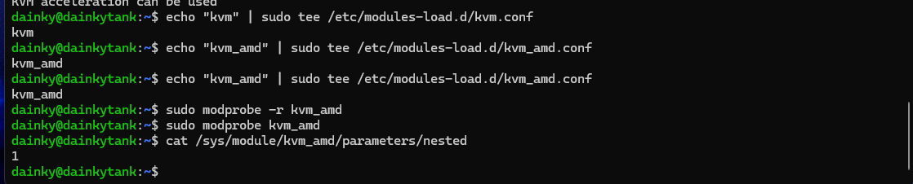

### Confirm Nested Virtualization
Check that nested virtualization is enabled for the CPU.  
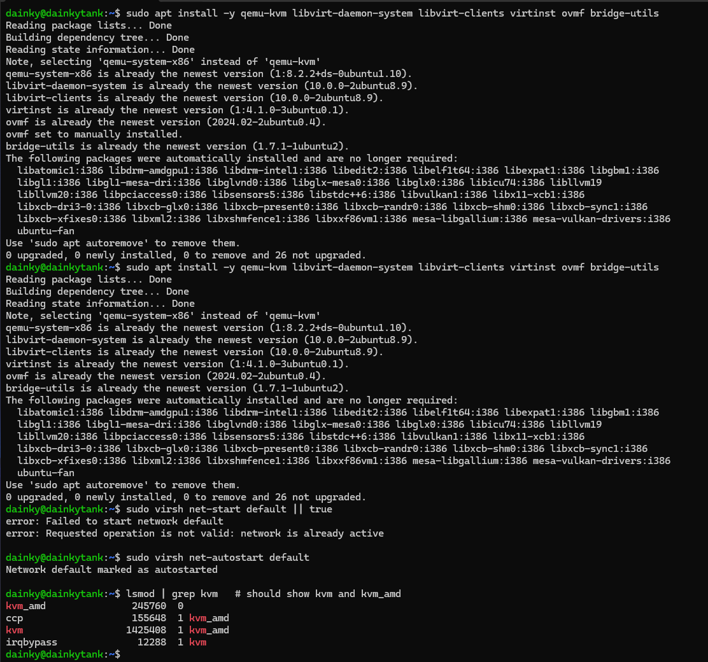

### Download Operating System ISO
Download the OS ISO that will be used for the virtual machine.  
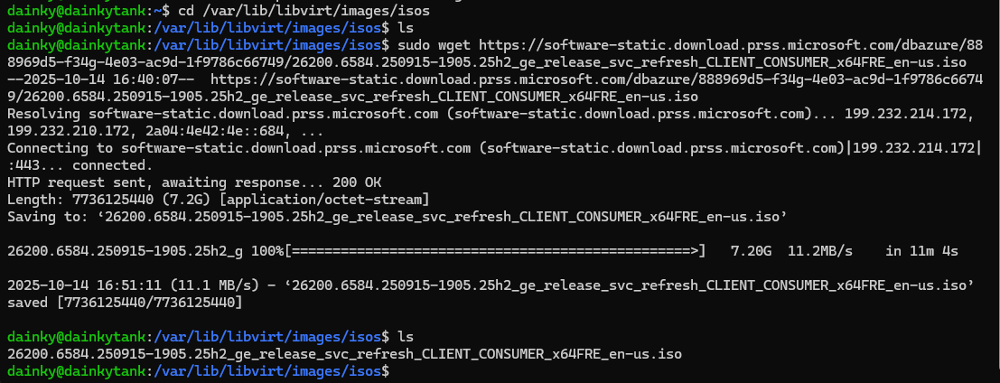

### Create Virtual Disk
Create a virtual disk that will be assigned to the VM.  
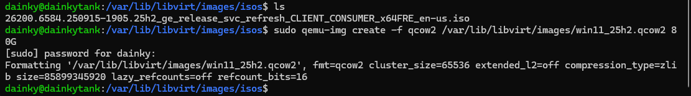

### Access the VM Console
Connect to the VM using VNC or a console to manage the installation.  
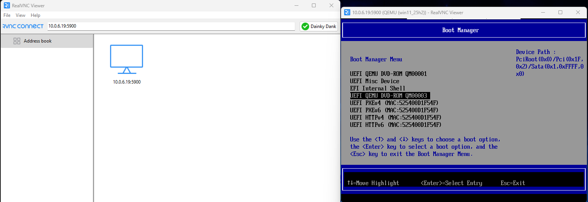

### Install the Operating System
Begin the operating system installation process inside the VM.  
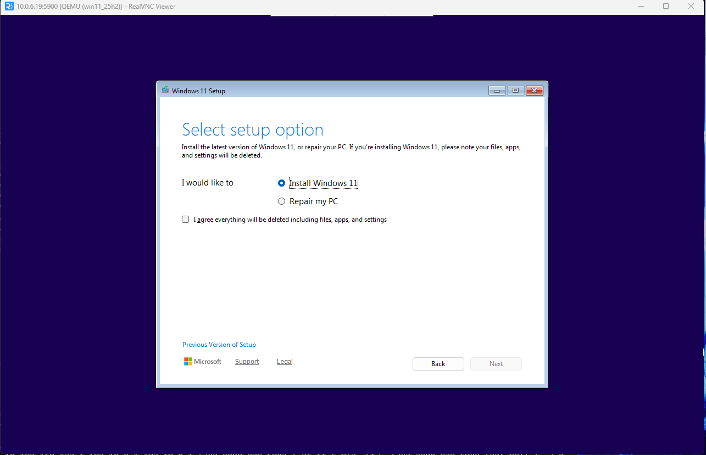

### Windows 11 Requirements Notice
Installer indicates TPM 2.0 and Secure Boot are required. We we able to bypass this using the CLI. But I have heard that Microsoft is closing that loophole soon for future 25h2 versions of windows. Below are the commands used to bypass the checks. 
reg add "HKLM\SYSTEM\Setup\LabConfig" /v BypassTPMCheck /t REG_DWORD /d 1 /f
reg add "HKLM\SYSTEM\Setup\LabConfig" /v BypassSecureBootCheck /t REG_DWORD /d 1 /f
reg add "HKLM\SYSTEM\Setup\LabConfig" /v BypassRAMCheck /t REG_DWORD /d 1 /f
reg add "HKLM\SYSTEM\Setup\LabConfig" /v BypassCPUCheck /t REG_DWORD /d 1 /f
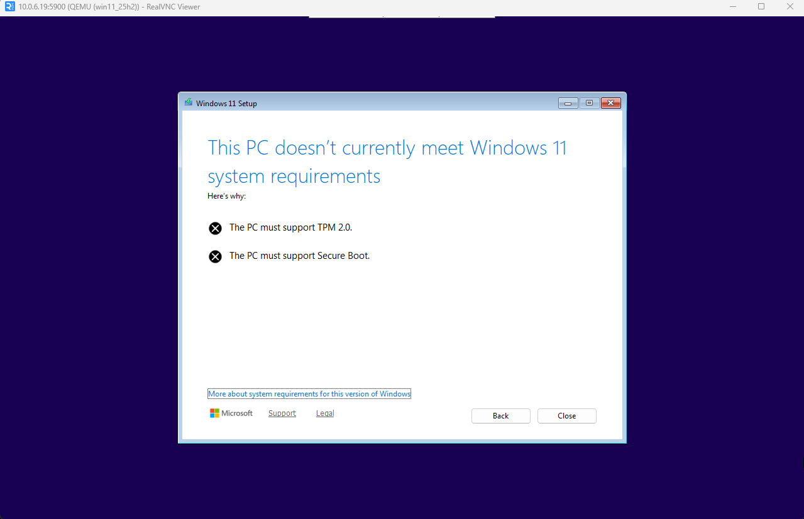

### Windows 11 Desktop
After installation, the Windows 11 desktop loads successfully.  

### Network Connectivity Issue
Post-install, the network connection failed and SSH access was lost. This was caused by the servers IP being changed after messing with the network settings to bridge into the VM. I need to create a static ip for the server, but I am moving in a few weeks so I'll wait until then to fix that. 
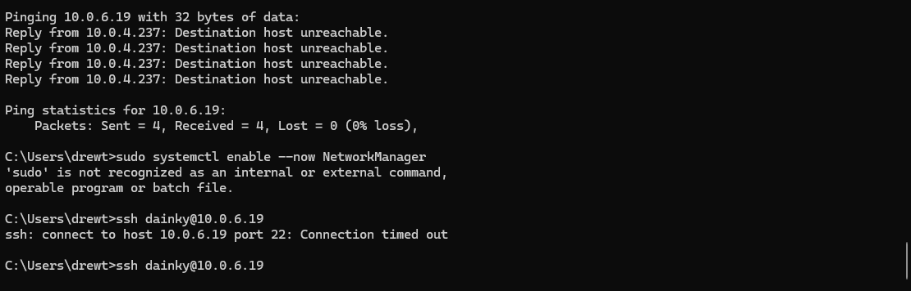

This guide is not an exact 1:1 of the website version. Unforuantely, redoing the guide for a second time to put on Github takes extra time that I really would rather be using working on a new project, so it is a bit more raw than the original. The smoother walkthrough is one my website at www.dainky.com, please use it instead of this one. 
